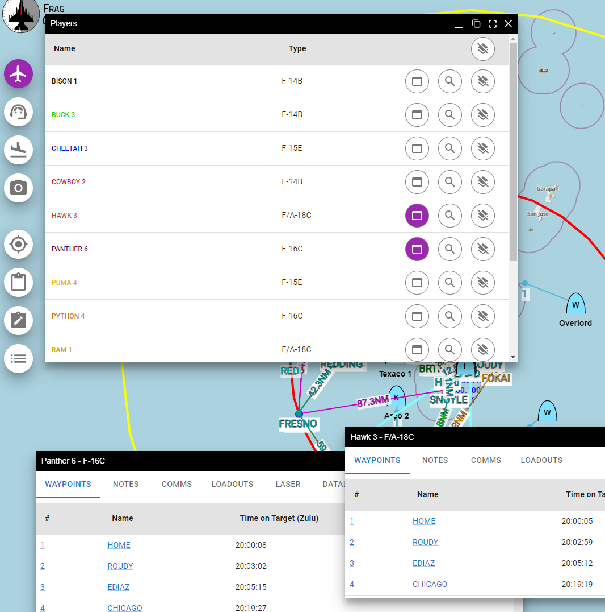
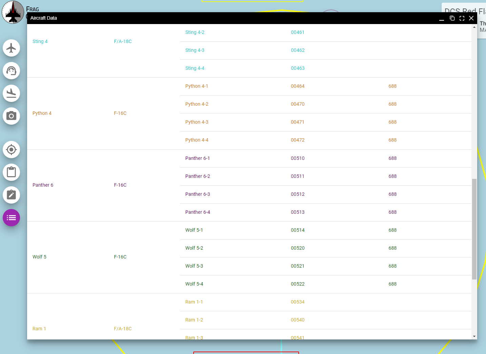
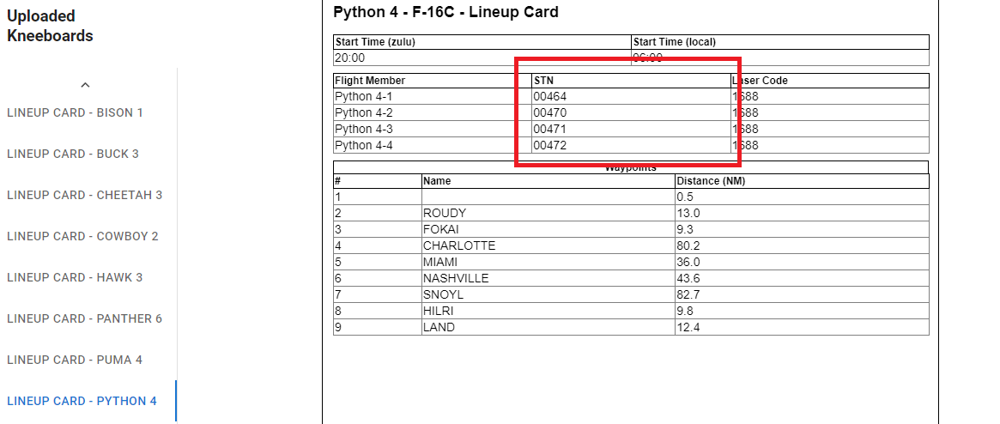
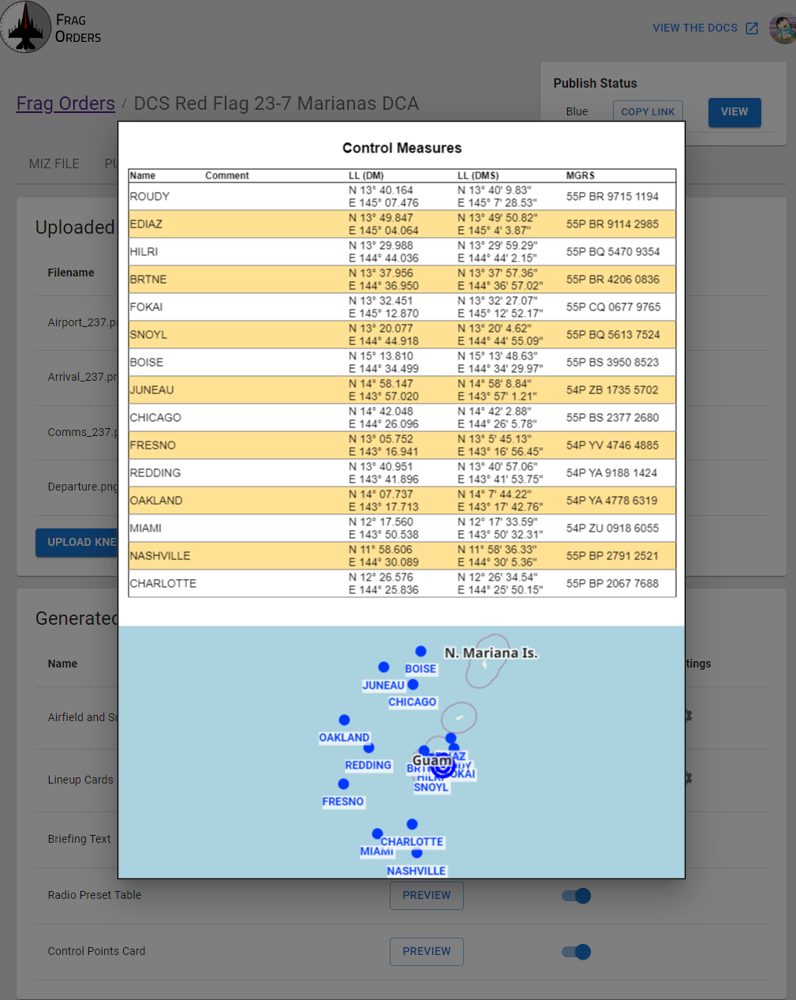

Here is a quick recap of the features that have been added to Frag Orders recently.

### Players Menu and Windows Re-work

The behavior of the window system has been altered to allow for multiple flight info windows to be open at once. Before, when a group was clicked, their flight info would be visible while the group was focused. 
Now, clicking on a group's "View Data" button in the "Players" menu will bring up their window.

In addition, the Player menu has been re-worked to allow for easier filter controls and focus logic, as well as to accomodate the new window logic.

This allows for two flights to be easily comparable, and for planners to reference other flights more easily.

### New Aircraft Data View

Accompanying the new datalink features that have been added to DCS are some new Frag Orders features to visualize datalink addresses.

A new navigation button and window have been added to the public frag order view. This window will show aircraft-specific data for all flight members, and is meant to make it easier for adding other flights to your datalink configuration. Laser code data is also visible here for modules that support it.

STN numbers will also appear on auto-generated lineup cards:

### Control Point Card

A new auto-generated kneeboard has been added that shows the "Initial Point" locations that are defined in the DCS mission editor. Frag Orders refers to them generically as "Control Measures" in the hopes of adding more types of points in the future.

This kneeboard is intended to make the in-game "Initial Points" useful for more airframes (not just the A-10!). 

