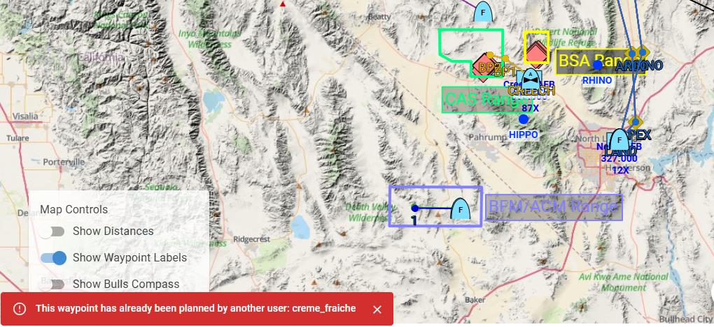
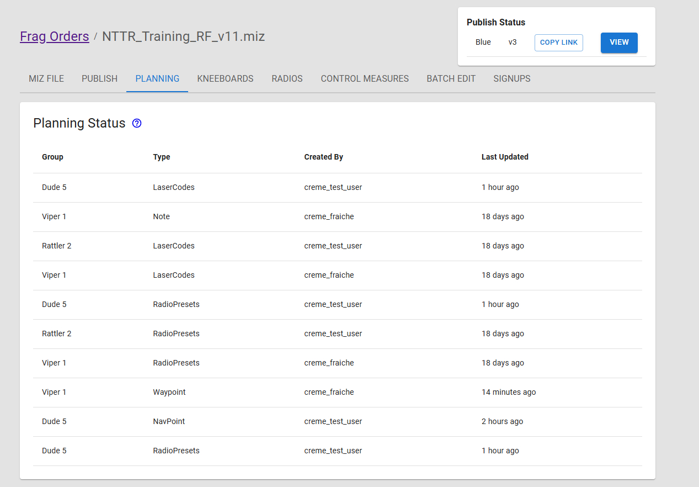

# New Planning Backend Implemenation 

One of the most larged pieces of technical debt in Frag Orders was the wonky mechanics around two users planning the same flight. The "rules" of planning flights have had several iterations, including various best-effort merging strategies, as well as prohibiting multiple planners from editing a single group. Each one of these iterations was a band-aid on a larger data modelling problem. This entire system needed to be re-worked.

## Multiple users planning the same group

The main goal of the new planning system is to allow multiple users to edit the same flight within a Frag Order without causing conflicts with each other. The new data model converts the plans from a single object per group to a collection of plan items for each group. This allows for different users to own different items in the list. As of this release, if users attempt to submit conflicting plan items, they wil recieve an error message:

Even though this waypoint will not be saved, the second user will still be able to submit radio frequencies or laser codes, for example. On the mission creator side, they will be able to see all of the plan items that have been submitted:

:::warning
The new planning system is an entirely different code path for planning running jobs on a miz file. Mission creators are encouraged to test the new planning features before running the mission.
:::

## Future Development Goals

This new system will allow us to extend planning capabilities to support other feature requests, including:

* **Real-time plan visualization:** showing what other users are doing on the Frag Order in real time
* **Advanced Fuel Planner:** Waypoint-by-waypoint fuel plans, edited by multiple users.
* **Timeline annotations:** Add events to the Timeline editor to improve coordination

All new frag orders that are created will use the new planning system. Existing frag orders created before the release will still default to the old system.
