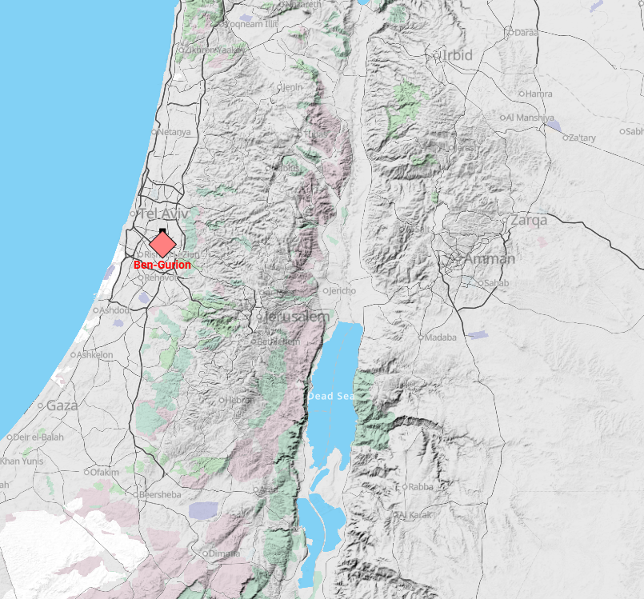

Frag Orders has moved to a self-hosted tiling solution. This new tiling system will hopefully be a large cost savings and ensure the long-term health of the product, as well as open up the ability to have custom tile sets and styling parameters.

## New Map Look

Our new map look has a new color scheme for various districts. The style of this map is a work in progress, and the upside of this new hosting solution is that the map styles are customizable, allowing for different styling schemes that better suit a military flight sim.

This change will also open up the possibility for individual users or groups to edit their map style to their liking. Stay tuned!