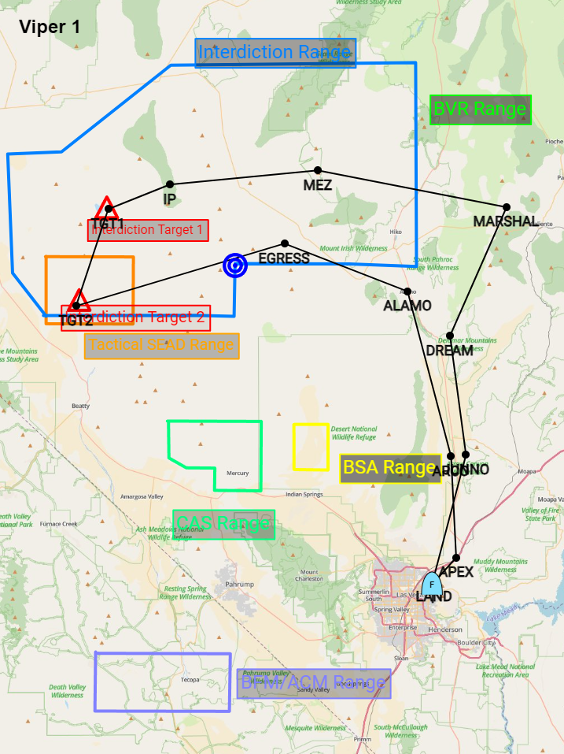
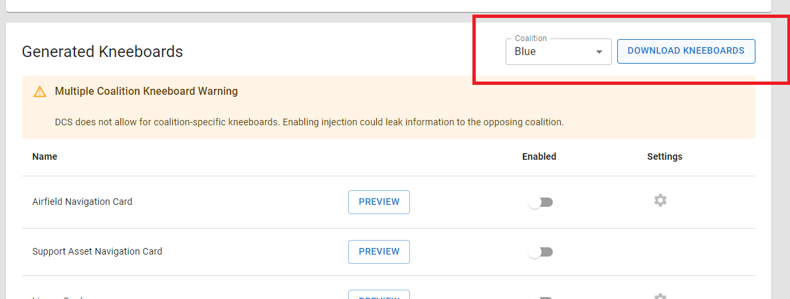
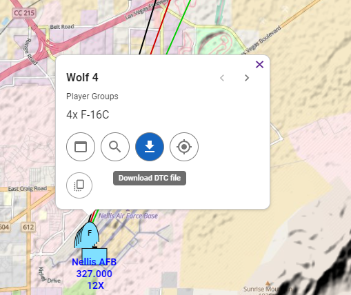

Lots of new features and bug fixes have been deployed in the last few months. Here is a recap of the highlights.

## Major Feature: Batch Edit

A new spreadsheet-centric workflow for editing data in your miz file has been added! The Batch Edit feature should make creating and updating large missions much easier.

[Read more about it in the docs](/docs/batch-edit)

<!-- truncate -->

## New control measure: Point

A new control measure type has been added. [Read more about it in the docs section](/docs/control-measures#point-control-measure)

## Save Radio Presets

It is now possible to save your radio presets to be used between Frag Orders. Read more about it [in the docs](/docs/configuring-radios#saving-and-reusing-radio-presets)

## New Kneeboard: Route Detail

A new generated kneeboard option has been added. The Route Detail kneeboard is meant to give more information about a group route, including threats, distances, and drawing objects.

## Kneeboard Pack Download

A new download button has been added to the Kneeboard page. This will generate and download all selected kneeboards in a .zip file for the selected coalition.

## DCS DTC download

A new button has been added to the Group detail hopup. Clicking the "Download DTC file" button will download a JSON file that is compatible with [DCS-dtc](https://github.com/the-paid-actor/dcs-dtc) project.

