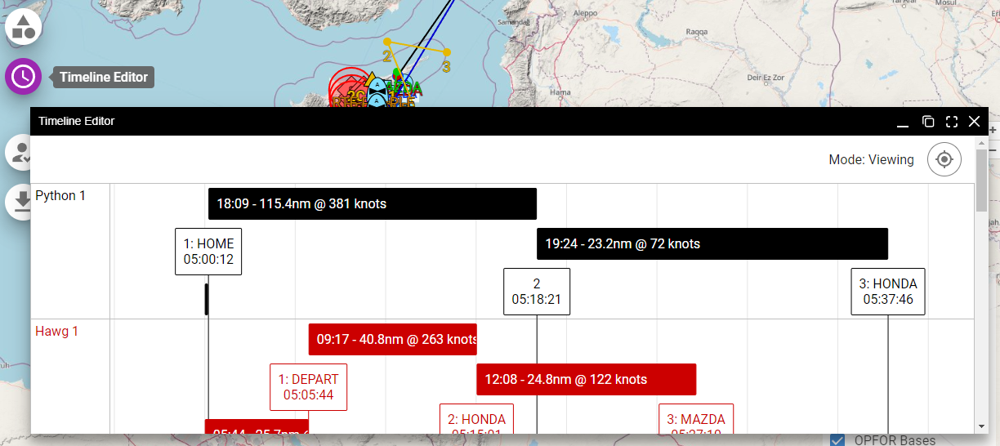
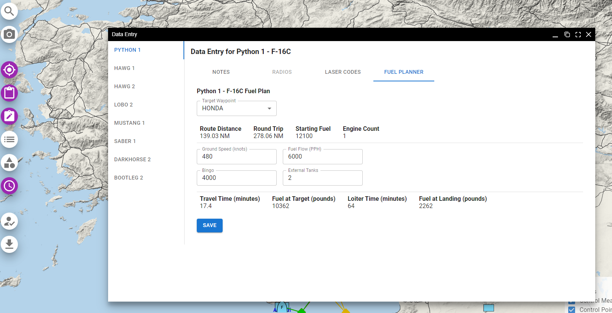

# September 2024 Development Update

Two new major features have been released to Frag Orders:

## Timeline Editor

The timeline editor has been added to give mission planners the ability to set their Time-on-Target information in relation to other flights. This will be an area where there will be more development in the near future. [Read more about it in the documentation](/docs/timeline).

## Fuel Planner

A new fuel planner widget has been added to help planners calculate and communicate their fuel gameplan. Check out the [section in the docs for more info](/docs/planning-a-flight#adding-a-fuel-plan).

