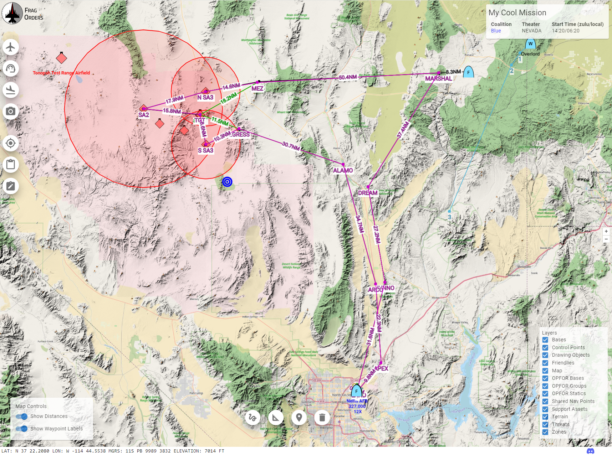

# Intro

## History

Frag Orders was created to allow for multiplayer DCS missions to be visualized, planned, and shared with mission participants ahead of time. Through several iterations, the tool has evolved to help in several areas of DCS multiplayer mission making:

* Raise the situational awareness of mission participants by providing an easy way to for them to see where they will be flying
* Cut down on the amount of briefing material that mission creators have to make
* Add an element of mission planning to the simulation that would otherwise be difficult in a multiplayer context

## How does it work?

Frag Orders works by parsing your .miz file, then modifying the mission data by applying various edits to the .miz data. These edits might include setting radio frequencies, applying user waypoints, and injecting kneeboards.

### Does Frag Orders store my .miz file(s)?

Yes! Frag Orders saves a copy of your .miz files on a server so that it can run jobs on it. If your .miz files contain any data that you do not want stored on a third-party server, do not use Frag Orders. Uploaded .miz files get removed periodically based on their creation date.

## Feature Overview

### For mission creators

* <b>Publish your mission:</b> Frag Orders extracts mission data and publishes to a hosted web page so that mission participants can see important information, such as waypoints, threat rings, and enemy locations.

* <b>Auto-generate kneeboards:</b> Automatically create briefing materials using data extracted straight from the DCS .miz file with the press of a button.

* <b>Let the pilots plan:</b> Mission participants will be able to drop waypoints, set radio frequencies, and add briefing notes to their in-game kneeboards.

## For mission participants
* <b>Review the plan:</b> Start building your situational awarness before the mission.

* <b>Collaborate with your wingmen: </b> Frag Orders includes planning and drawing tools to help organize and communicate with your flight.

* <b>Plan your flight:</b> Add and modify waypoints from the planning interface that will be written to the .miz file. Planners can also edit radio frequencies and add notes to their in-game kneeboard.
