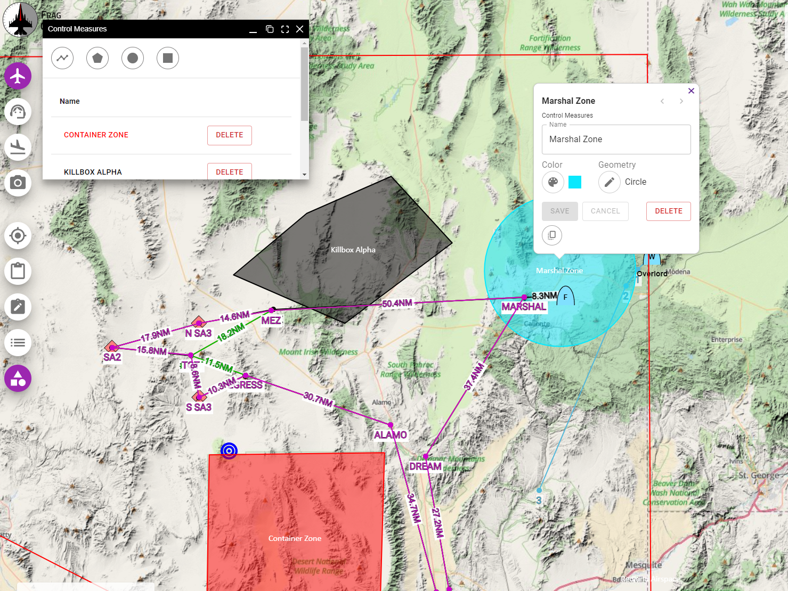
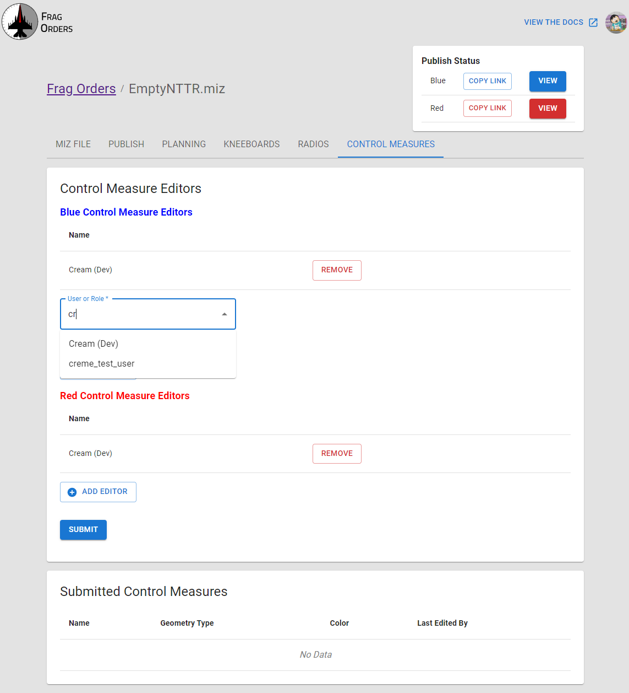
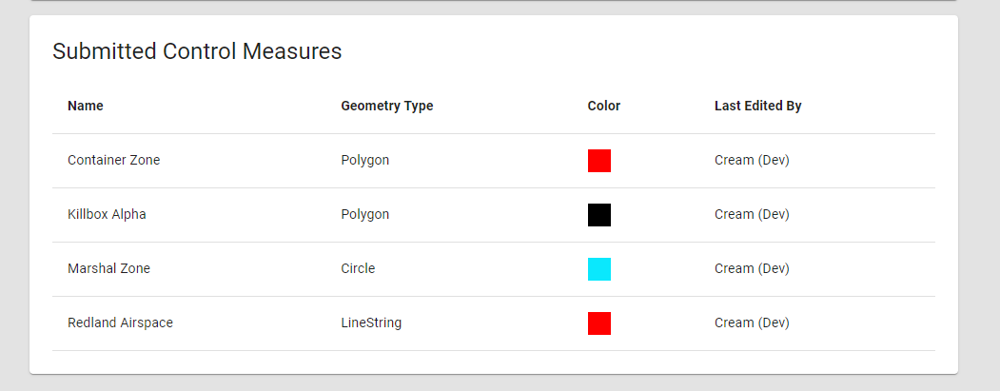
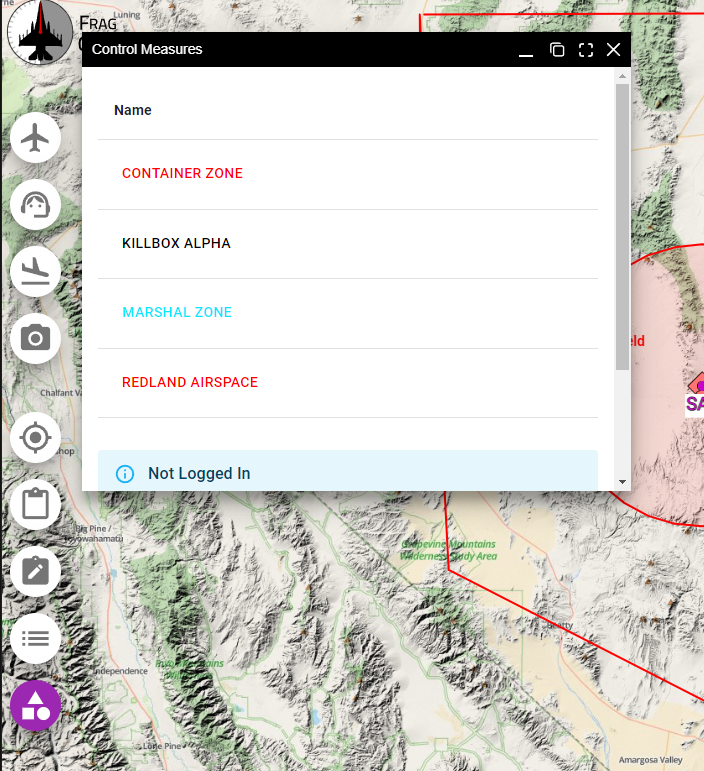
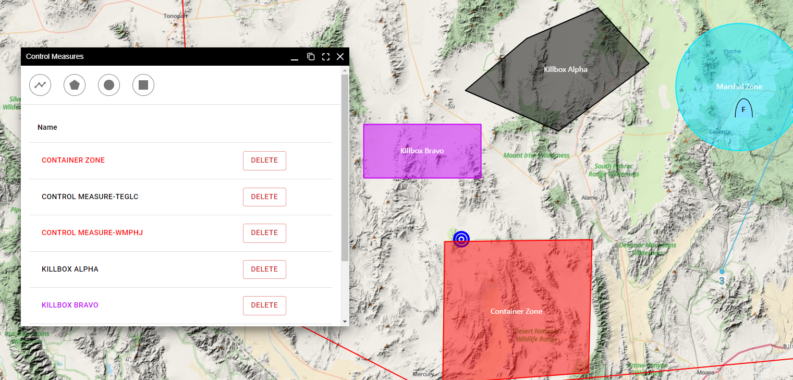
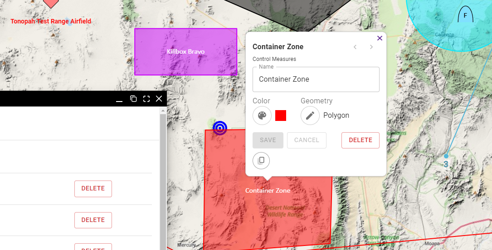
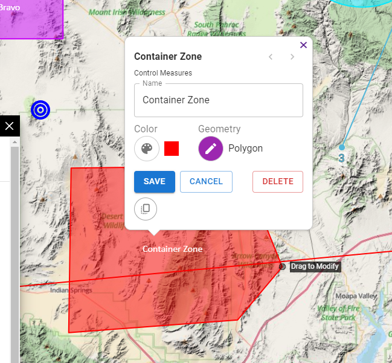
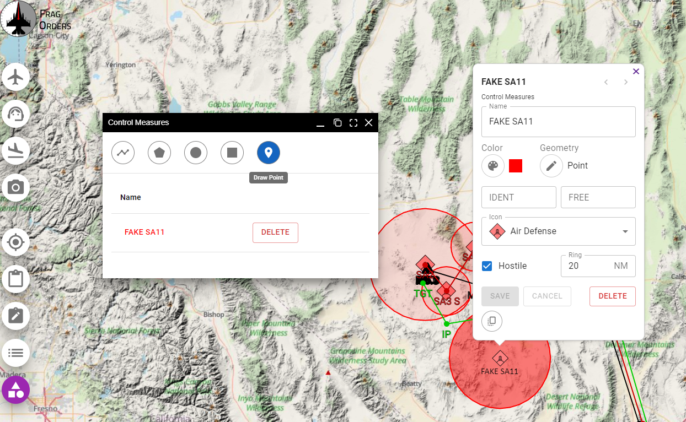

# Control Measures

There may be situations where mission participants want to add drawings to the map to aid in planning. Frag Orders provides this functionality via drawing tools known as Control Measures. Mission creators can any users from a Discord server as a Control Measure editor.

## Adding Control Measure Editors

From the Frag Order details page, navigate to the Control Measures tab. You can add multiple editors at once, similar to adding mission planners:

Once control measure editors have submitted control measures, they will be listed on the table below the editors information:

## Viewing and Drawing Control Measures

On the public Frag Order, users will be able to view a list of control measures using the navigation button on the left side of the public Frag Order window:

### Drawing Control Measures

Authenticated users will be present with a set of drawing tools they can use to draw shapes on the Frag Order. Once a shape is drawn, they can edit the name, shape and geometry of the Control Measure. Once added, these shapes will be present for all viewers of the Frag Orders.

:::warning
Users must be authenticated via Discord in order to view the Control Measure drawing tools.
:::

Control Measure drawing tools:

* Line Tool: draws a line with segments
* Polygon Tool: draws shape with a filled in area using line segments
* Circle Tool: draws a circle with a filled in area
* Rectangle Tool: draws a 4-sided polygon. Note that the editing interaction for this shape is similar to the line string editing interaction.
* Point tool: draws a point with some special properties. See the [Point Control Measure section](/docs/control-measures#point-control-measure) below for more info.

### Editing Control Measures

To edit a control measure, click the feature on the map to bring up the edit menu:

Clicking the Pallette Icon will bring up the color select menu. Clicking the pencil will allow you to edit the geometry of the shape. You can also move the control measure by clicking the center and dragging to the new position:

### Point Control Measure

The Point control measure allows for a variety of different information to be added to the Frag Order. Control measure editors will be able to add symbols and colors to a Point control measure. If an "Air Defense" icon is selected, the editor will be able to add a threat ring in a color and radius of their choosing.

:::warning
The IDENT and FREE fields are Apache specfic, and currently display only. They will not be applied to the .miz file.
:::