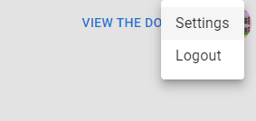
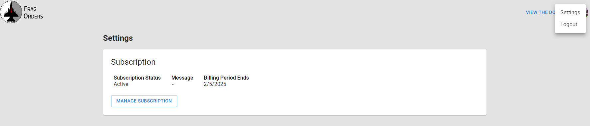
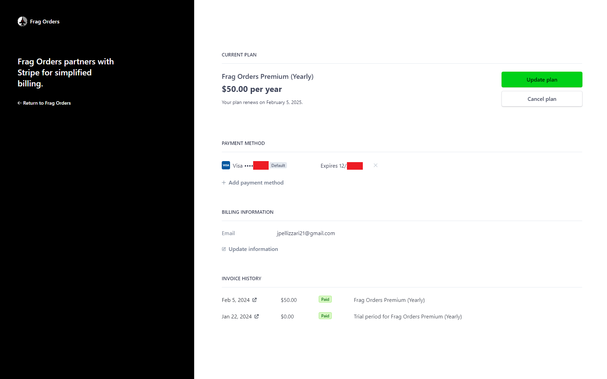

# Pricing

Frag Orders uses a "Freemium" pricing model. The base visualization features are free for mission creators and participants. The advanced features of Frag Orders are available via a **Frag Orders Premium** subscription.

## Frag Orders Basic - Free
Frag Orders Basic includes:

* Hosted mission visualization map
* Drawing tools for participant coordination and planning
* Mission creator map visibility controls

## Frag Orders Premium
### **$5 per month or $50 per year**

Frag Orders Premium includes:

* Flight planning for mission participants
* Auto-generated kneeboards injected directly into your .miz file
* Radio preset and laser code configuration
* Countrol measure drawing for mission participants
* Batch edit and CSV import features

## Pricing FAQs

Q: **Do mission participants and planners need to subscribe?** 
A: No, mission participants and planners can use Frag Orders without a subscription. Mission creators need a Premium subscription to unlock the planning interface.

Q: **Are volume discounts available?** 
A: Not currently, but that feature is coming soon!
    
## Managing your subscription

To manage your subscription, click on your user avatar, then click the "Settings" option.

Click on the "Manage Subscription" button. This will take you to the payment management page, hosted by Stripe.

