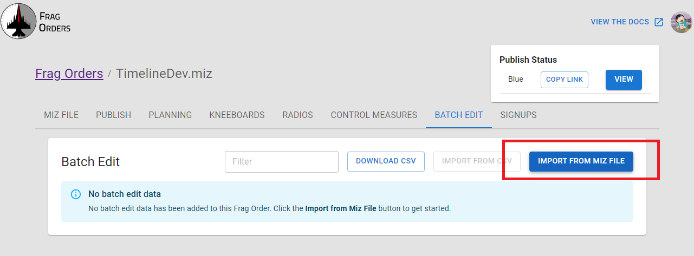
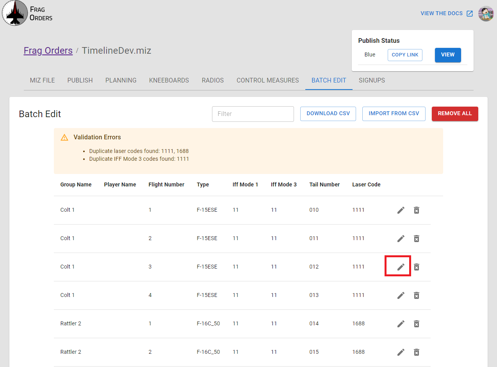
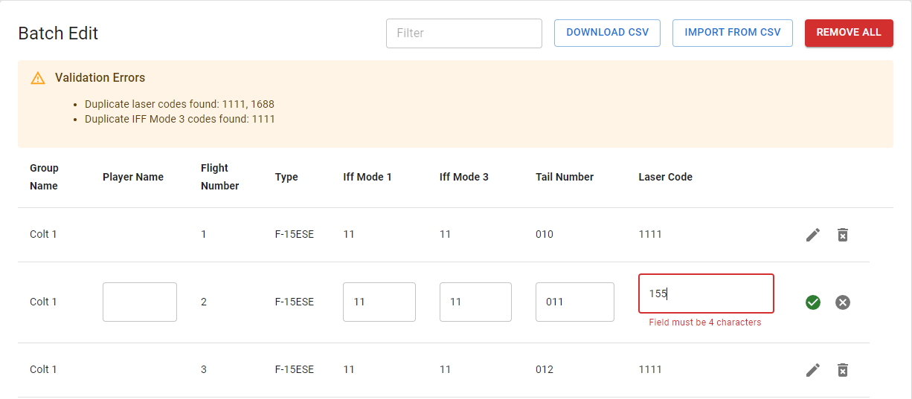
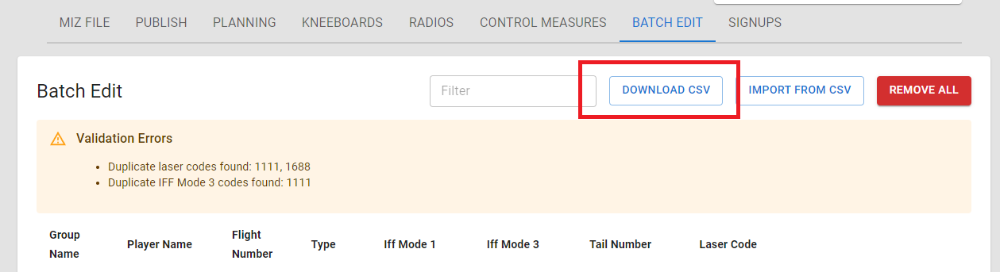
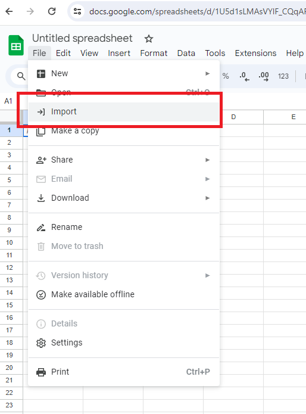
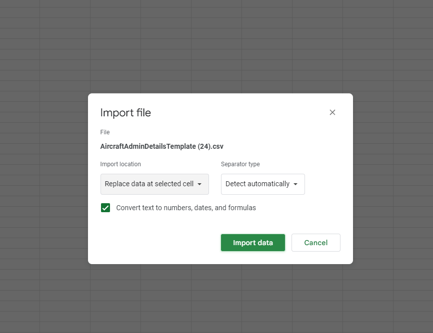
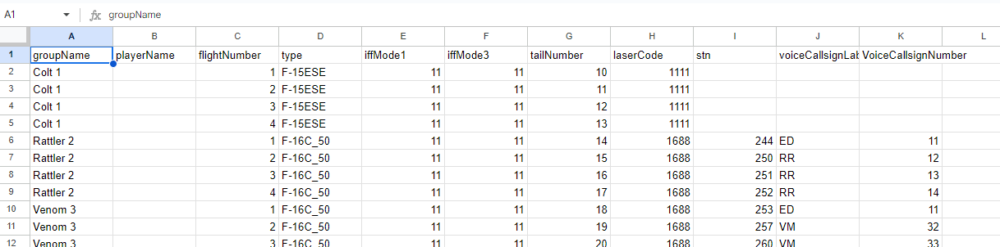
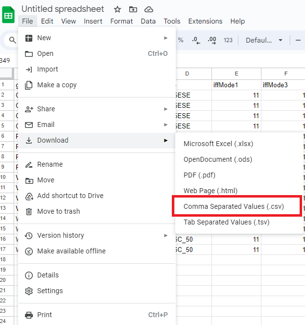
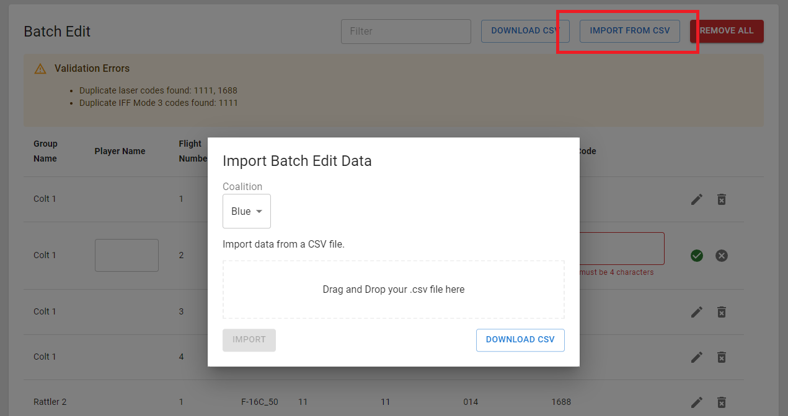
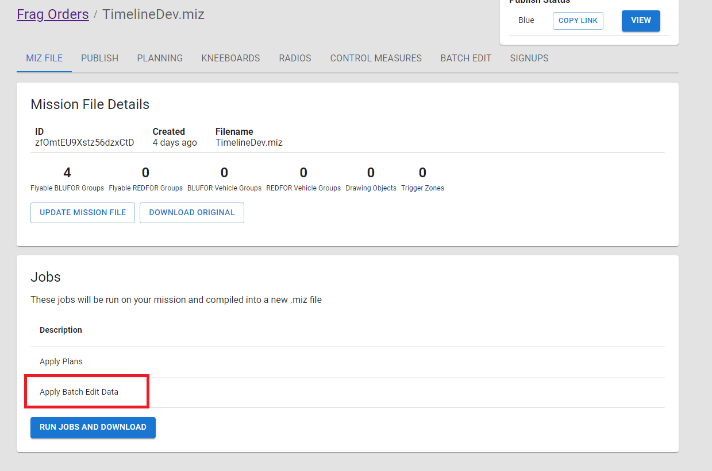

# Batch Edit

For missions with a lot of players, it can be difficult to make sweeping changes to many groups at once. 
The Batch Edit feature allows mission creators to leverage external tools to make this process less difficult.

### Import data from the .miz file
Import a copy of the data from the current miz file. This will create a copy of the miz data that can be edited.

### Editing in Frag Orders
Once imported, you can edit the rows directly in the Frag Orders user interface. Click the pencil icon to edit a row.

There is some input validation that should help guide the editing process.

### Editing in a spreadsheet

The more powerful workflow for the Batch Edit feature involves exporting the data to something like Google Sheets or Excel to do your editing.

Start by downloading the CSV file:

This will download a file called `AircraftAdminDetails.csv`. Open this file to your spreadsheet program of choice. For this example, we will use Google Sheets, but any CSV editor will work.

Import the file:

Select the import method of your choice:

Edit the fields as required. Be sure to preserve the column names:

:::warning
Frag Orders does not validate your inputs! Be sure to enter valid values for each of the fields.
:::

Export the edited data as a CSV:

### Uploading a CSV

Upload your CSV to Frag Orders via the "Import from CSV" button. Drag and drop your exported CSV file, or click the drop area to open a file browser.

When Frag Orders runs jobs on your .miz file, this data will be applied. You should see the "Apply Batch Edit Data" job on the "Miz File" tab:

