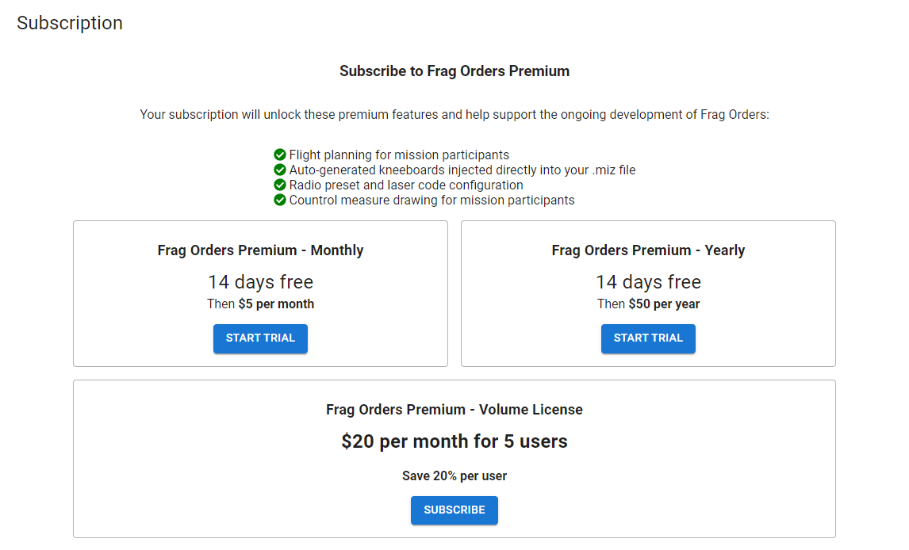
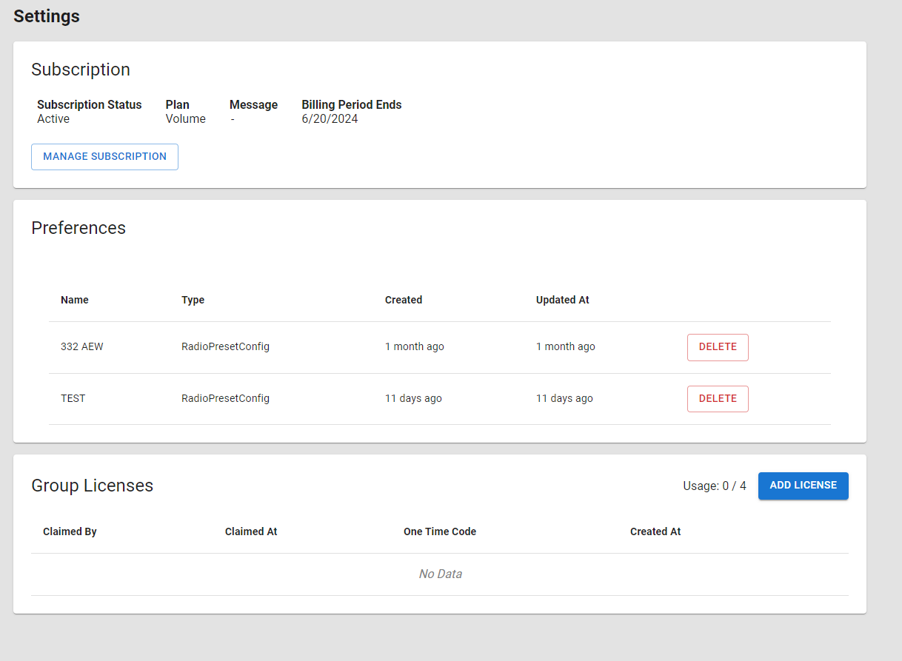
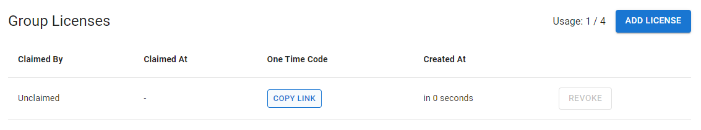
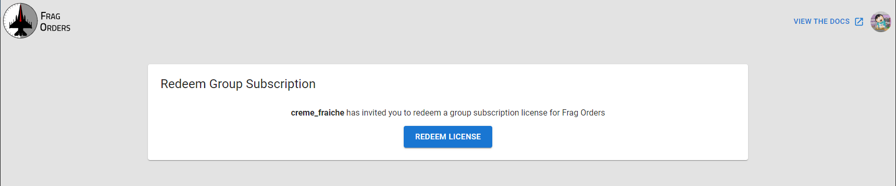
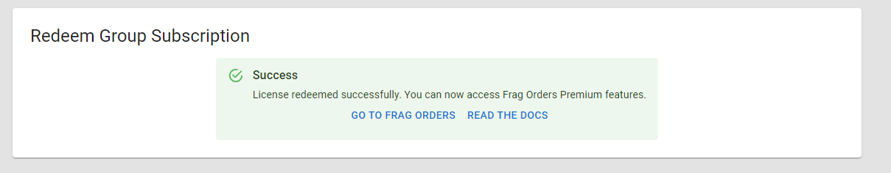
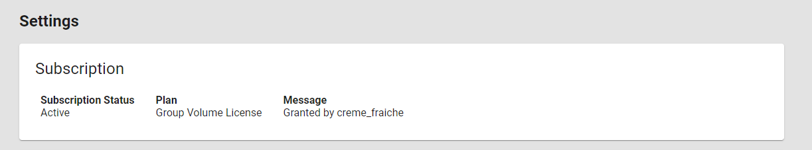
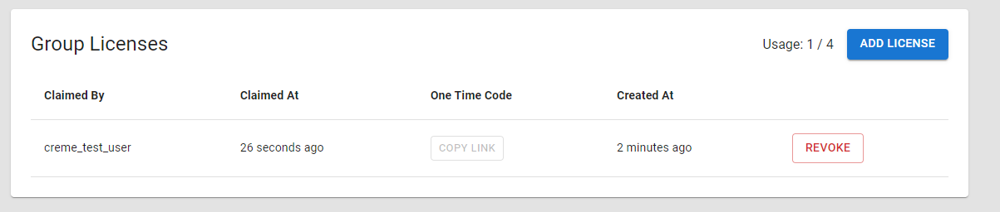
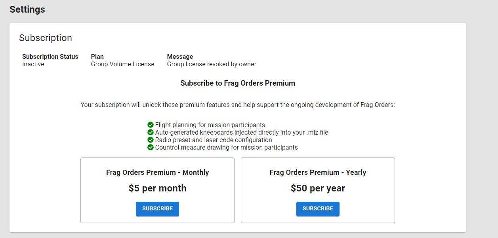

# Volume Licensing

:::warning
Volume Licensing is only available on request. Volume Licensing UI elements will be hidden without a special feature flag. Contact a Frag Orders site admin to enable the feature flag for your account.
:::

## Purchasing a Volume License

Once a site admin has enabled the Volume Licensing feature flag for you account, you will be presented with a new UI element that will allow you to purchase a 5-pack of user licenses.

After completing the purchasing flow, you will see your subscription details reflected on the user settings page, as well as a new Group Licenses UI element at the bottom of the page.

:::info
One of your volume licenses will be used as your own license, leaving you with the ability to allocate 4 more licenses to other people.
:::

## Allocating a Volume License

To allocate one of your license to another user, click the "Add License" button. This will provision a license allocation against your Volume License.

This will generate a one-time code that will be used to redeem the license by another user. Click on the "Copy Link" button to copy the redeem URL to your clipboard, and send that link to another person.

When they visit the URL, they will see a page that allows them to claim the volume license.

Click "Redeem License" to claim the volume license. If successful, they will see a sucesss message and a screen that directs them to Frag Orders.

:::warning
Frag Orders users that already have an existing active subscription will not be able to redeem a license. They will need to cancel their existing subscription before redeeming a volume license. Contact a Frag Orders site admin if there are issues with redeeming licenses.
:::

## License Status

Volume license users can see their subscription status and the owner of the "parent" subscription on the Settings page.

Owners of a top-level volume license will be able to see who has claimed their volume license allocations.

Clicking the "Revoke" button will remove a user's subscription and put the Group License allocation back in the license pool. Revoking a user's license will not destroy any of their data, but will turn off the premium sections of the Frag Orders UI. The subscription status section of the UI will show a notice about their license being revoked.

:::danger
If top-level Volume License subscriber cancels their subscription, all child subscriptions will also be deactivated. Please contact volume license users before deactivating your account.
:::
