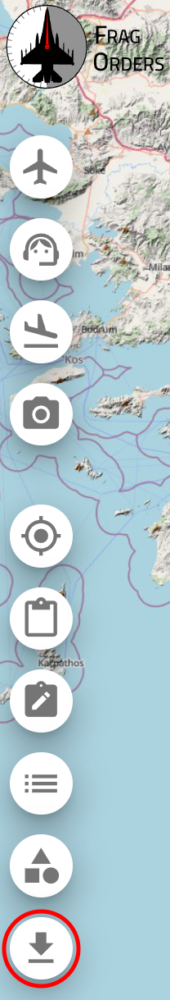

# Tacview Export

Frag Orders provides you with the ability to export [Control Measures](../docs/10-control-measures.mdx) and Flight Waypoints to an `.xml` file as [Tacview Static Objects](https://www.tacview.net/documentation/staticobjects/en/). This allows you to review a Tacview ACMI recording of the mission in Tacview with your Control Measures and waypoints overlaid for better debriefing.

Control Measures can be colored the same as in Frag Orders. However, due to a known limitation with Tacview's `Line` object, flight paths are not color-coded. Waypoints for flights will be rendered at the altitude set within Frag Orders:


## Exporting the Tacview XML file from Frag Orders

First, [Create and Publish a Frag Order](../docs/2-creating-and-publishing.mdx). Then, make any desired Control Measures.

To export the Frag Order to Tacview XML, click the Tacview Export button on the left navigation bar.



## Loading the Tacview XML file in Tacview

After downloading the `.xml` file, move it from your downloads folder to:

```
%PROGRAMDATA%\Tacview\Data\Static Objects
```

Then, restart Tacview. If you look at the area of the world where your mission is, you should see the Control Measures and flight paths as 3D objects on the Tacview map. You can now load a Tacview ACMI file and review it with the Tacview Static Objects overlaid.

---

These adjustments enhance readability and ensure users understand each step without altering the original meaning.