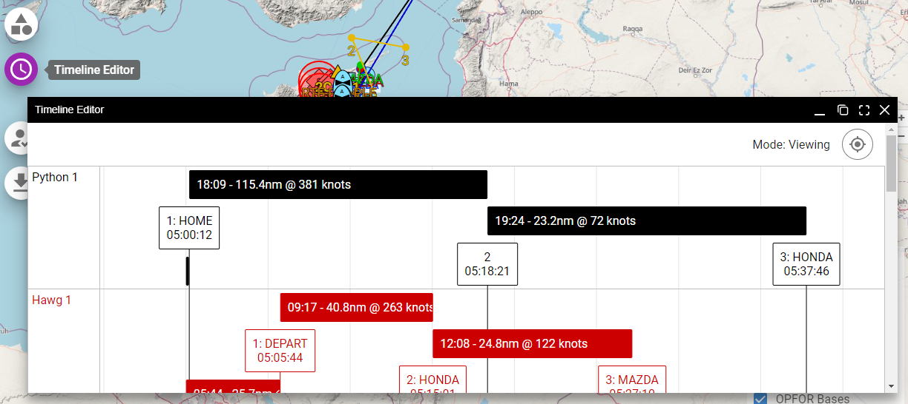

# Timeline Editor

For groups that are trying to utilize Time-on-Target in their mission planning, the timeline editor can be a handy tool for visualizing and editing waypoint ToT values. The "clock" button on the left navigation section will bring up the Timeline Editor.

## Editing Time-on-Target

If a user is logged in and is a planner, they will be able to click and drag the waypoints to change the ToT. Be sure to enter planning mode by clicking on the planning mode icon in the top right of the window.

Planners will only be able to edit waypoints for which they have planning privileges.

