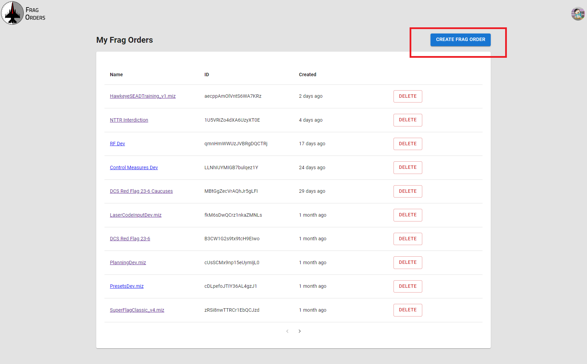
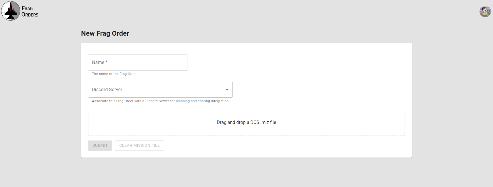
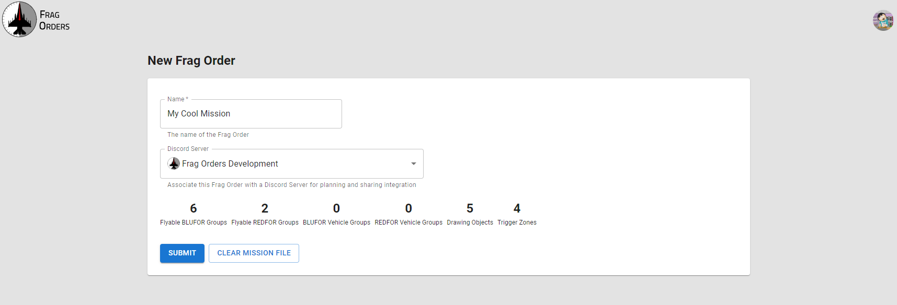
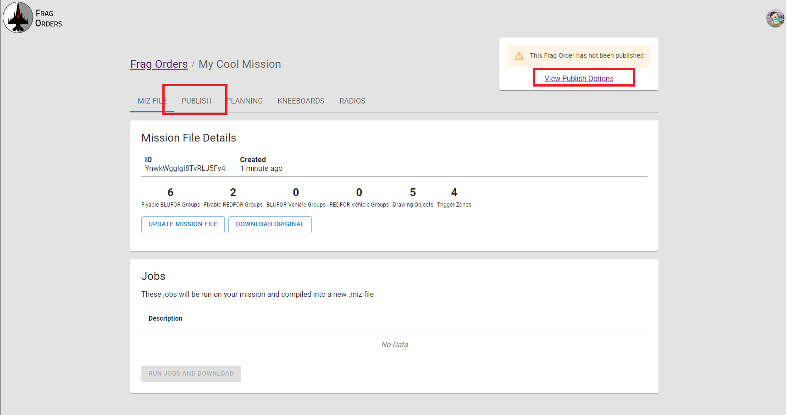
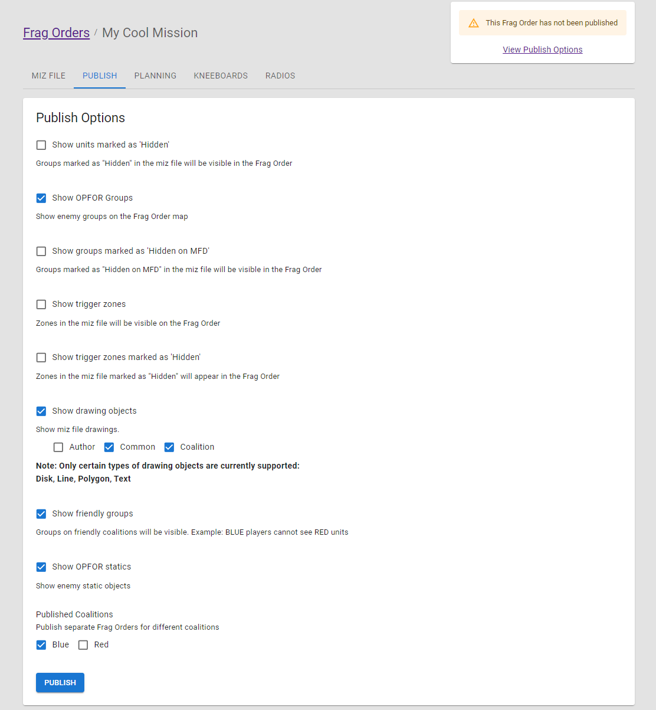
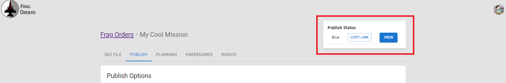
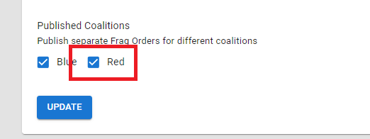
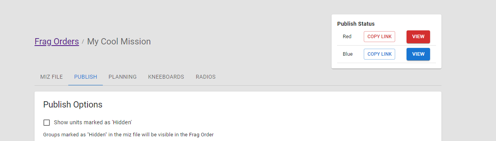

# Creating a Frag Order

To create a new Frag Order, click the "Create New Frag Order" button on the home page.

## Mission file upload

On the "New Frag Order" screen, you can give your Frag Order a name. If no name is provided, the name will be populated from the .miz file name.

The Discord Server field allows for the Frag Order to be associated with a given Discord Server that you are a member of. This will be used for managing planning permissions. For more information, see the [Planning](./6-managing-planners.mdx) section of the docs.

Drag and drop your .miz file into designated area, or click the area to bring up your file upload interface.

Once your file is uploaded, Frag Orders will parse your .miz file, and you will see some statistics about the .miz file that Frag Orders has detected.

Click the Submit button to save the Frag Order. Note that your Frag Order is still private and only visible to you at this stage.

### Updating an existing miz file

You can re-upload a or updated miz file at any time by clicking the <b>Update Mission File</b> button. When you upload a new .miz file, your published Frag Order will be automatically updated with the new mission data. Frag Orders does not change this file until the "Run Jobs and Download" button is clicked. See the [Export a mission file section](./8-export.mdx) for more information.

## Publish options

To publish your Frag Order for public consumption, navigate to the "Publish" tab of the Frag Order.

The publish options page will allow you to control which elements of the .miz file get published to the Frag Order. For example, there may be situations where you do not want OPFOR groups to appear on the Frag Order. The "Show OPFOR Groups" checkbox will allow you to control whether or not enemy units/groups are shown.

Each option should have a description of the option underneath the name of the option. Select your options and click the "Publish" button to make the Frag Order publicly available.

Once the Frag Order is published, the Publish Status widget at the top of the page will change to give a "Copy Link" and "View" button that can be used to share the link, or open the public Frag Order in a new tab.

## Publishing multiple coalitions

In situations where you have players participating in both coalitions, you can publish a Frag Order for each coalition. These will be separate links that exporess the opposing coalition as "OPFOR". Planning rules will also be separated by coalition:

Once the second coalition has been published, the Publish Status widget will change to provide links to both coalitions:

import Alert from '@mui/material/Alert'
import Box from '@mui/material/Box'
import Typography from '@mui/material/Typography'

:::warning
**Publishing both Coalitions will disable certain features of Frag Orders.**

For example, Kneeboard publishing will be disabled when both Red and Blue coalitions are published.

This is a limitation of DCS where the kneeboards in the mission cannot be made coalition specfic.
:::

