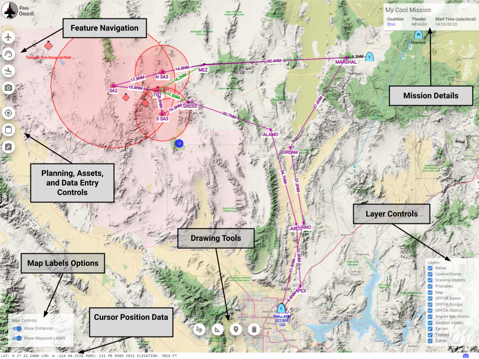
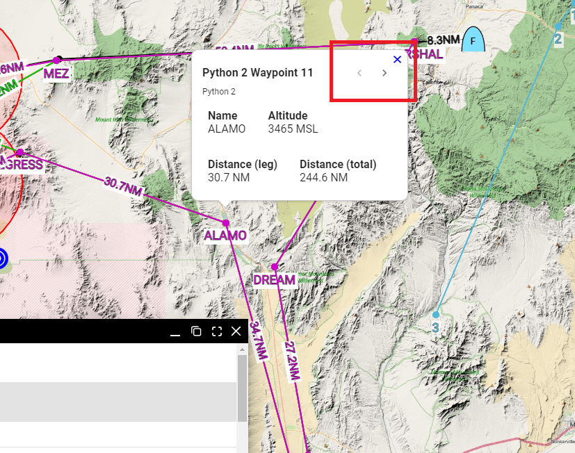
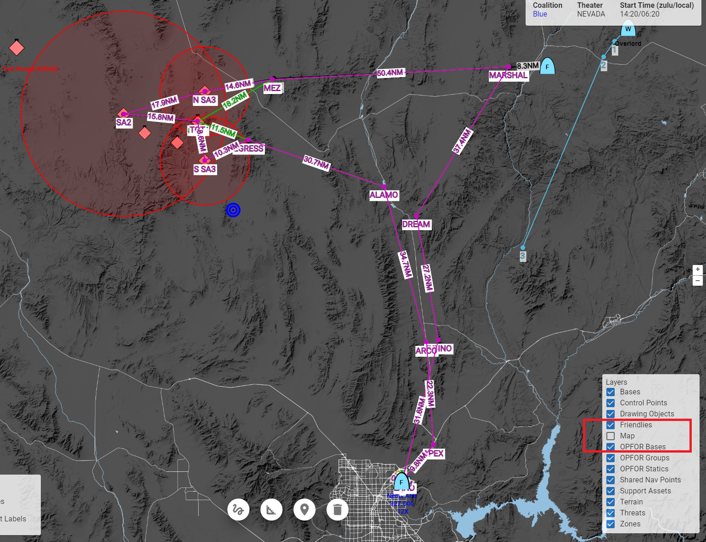
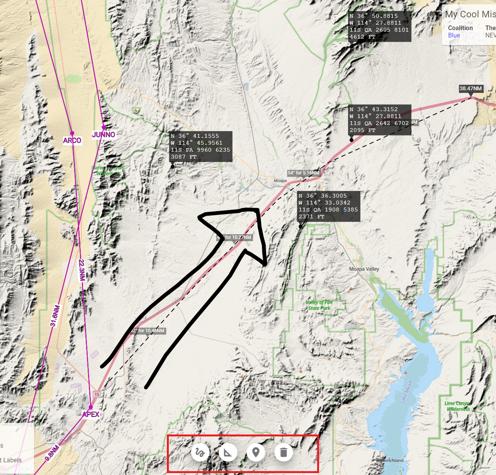
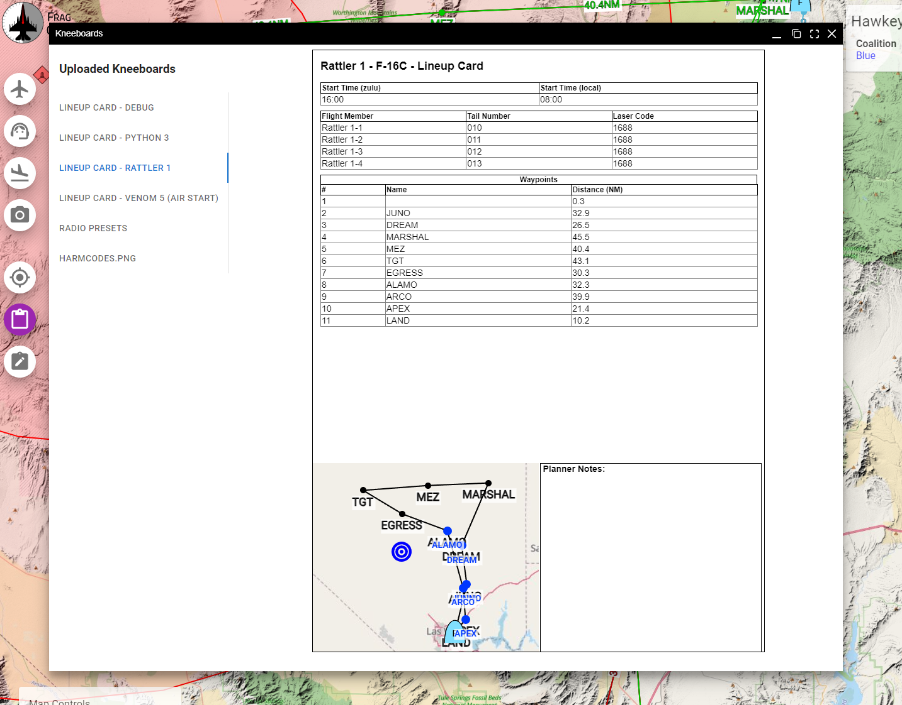

# Viewing a Frag Order

## A Tour of a Frag Order

* <b>Mission Details:</b> Contains basic info about the mission file 
* <b>Feature Navigation:</b> Opens windows that allow for focusing on the various map features. This includes things like player groups, airbases, support assets, etc.
* <b>Planning, Asset, and Data Entry Controls</b>: Opens panels that relate to various planning operations, including visualizing kneeboard assets, doing planning data entry, and enabling planning mode. For mor information on planning mode, see the [planning mode docs page](./7-planning-a-flight.mdx).
* <b>Map Labels Options:</b> Toggle the differnt text labels on the map
* <b>Drawing Tools:</b> Enables various kinds of drawing tools. See the [Drawing](#drawing) sectino for more info.
* <b>Cursor Position Data:</b> The current position of the mouse in Lat/Long and MGRS
* <b>Layer Controls:</b> Toggle various map layers

You can pan around the app my holding the right mouse button, and click on map features with left click to see more information. Pinch to zoom and other mobile gestures should also work as expected.

## Finding Map Features

Open the Feature Navigation windows to see the list of available features. After clickng on a feature in the table, the map will pan to the feature and display additional context information about the feature. For example, when we click on the "Fantom 3" group in the "Players", we get a popup with additional data. If we then click on one of the waypoints, the map will pan to that waypoint:

If there are two features that overlay each other, you can cycle through the features using the arrows on the feature hopup dialog:

## Toggling Layers

The You can enable and disable layers using the layer controls. In this example, we have turned off the "Map" layer, which leaves us without the political geography layer:

## Drawing

The drawing tools allow for basic marking on the map. This can useful when determining distances, gathering points of interest, or marking points of interest.

:::warning
All drawings are only visible locally. They will not be saved with the Frag Order, and will be deleted if you refresh the page.
:::

Drawing tools overview:

* Freehand Draw: a free-form drawing tool
* Measure: Place a line with annotate distances. Left-click to add a new leg; double-click or right click to disable the measure tool.
* Drop Point: drop a point on the map with Lat/Long, MGRS, and elevation data.
* Clear Drawing: clear all drawings from the map

## Viewing Kneeboards

If the mission creator has adding any kneeboards to the Frag Order, they will be viewable in the "Kneeboard" viewer window. This is a good way to see information will be available in your aircraft ahead of time.

Learn more about [kneeboard management as a mission creator](./4-auto-generated-kneeboards.mdx)

