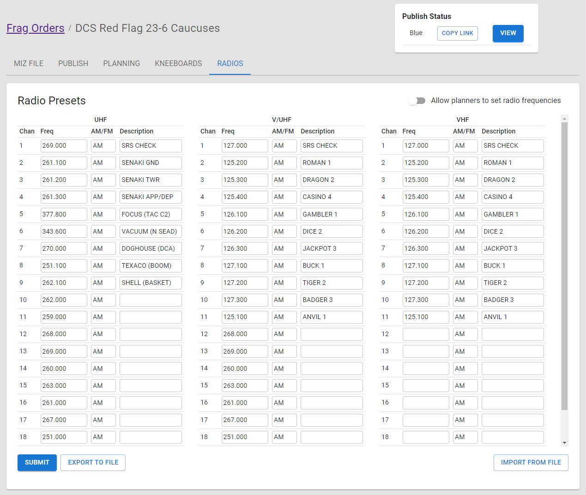
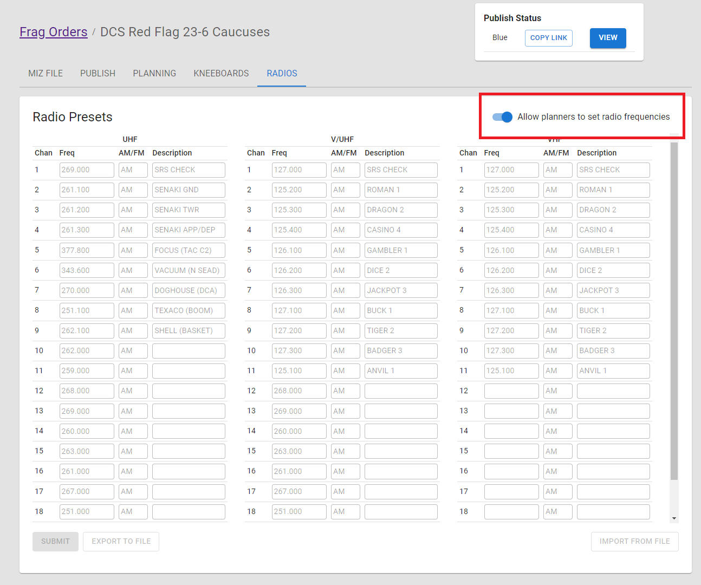
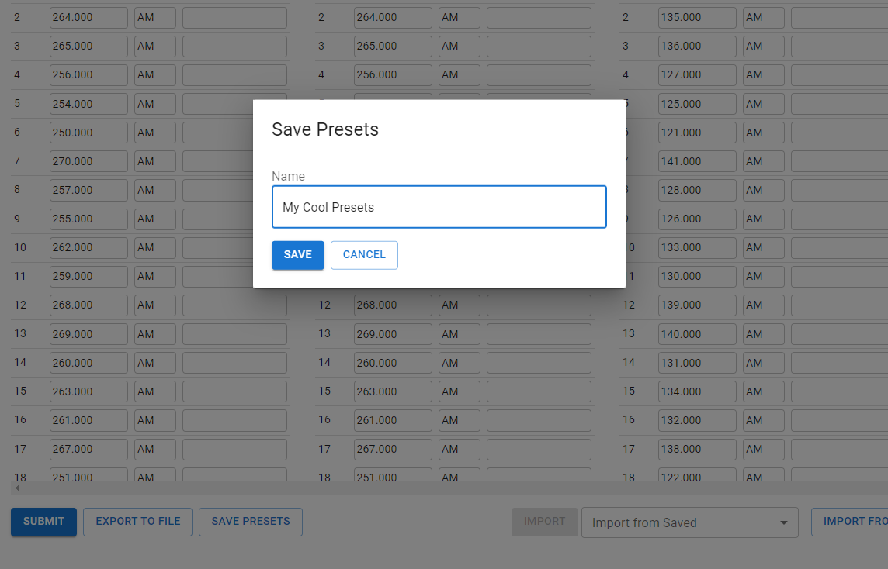
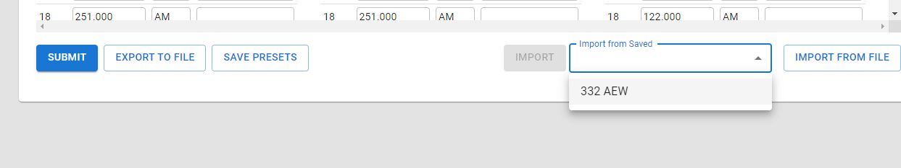
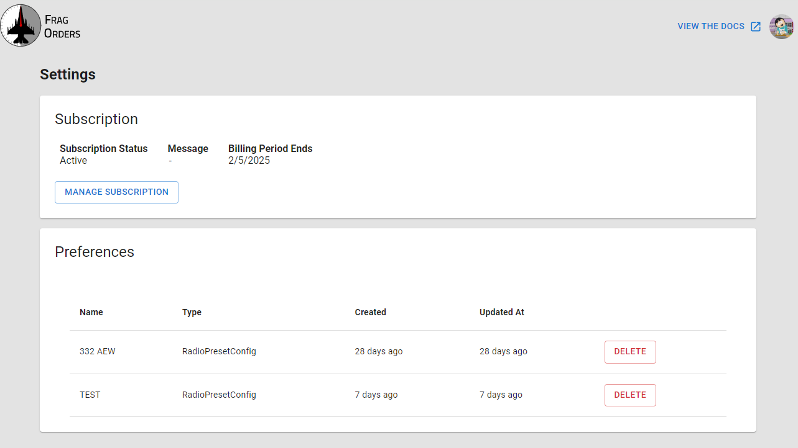

# Configuring Radio Presets

Mission creators can create a master comms plan that will be applied to each aircraft. This allows pilots the ability to utilize preset radio channels, instead of typing in frequencies by hand.

To create a comms plan, fill in the frequencies and channel descriptions in the "Radios" tab.

Since each aircraft can have a different set of radios, Frag Orders makes a "best effort" attempt to assign preset frequencies across the various DCS modules.

The logic of applying frequencies works like this:

* If a DCS module has a UHF-capable radio, Frag Orders will apply the presets defined in the "UHF" column to the first UHF-capable radio it finds. This includes radios that support both UHF and VHF

* If a DCS module has a radio capable of UHF and VHF, the presets defined in the "V/UHF" column will be applied. If a module has 2 V/UHF capable radios, the "V/UHF" column is applied to the "second" radio. The order of the radios is determined in the DCS miz file. Generally, these map to "COM1" and "COM2"

* If the DCS module has a VHF-only radio, the VHF column is applied to that radio.

A practical example:

1. Hornets have 2 ARC-210 V/UHF radios, so they will have the "UHF" and "V/UHF" radios applied to their left and right radios respectively.

2. The Strike Eagle and Tomcat have one UHF and one V/UHF, so they get the UHF and V/UHF columns applied as such.

3. The Viper has a separate UHF and a VHF radio, so they will not get the V/UHF frequencies applied.

Note that Frag Orders does not do any validation on radio frequencies, and only supports AM frequencies currently.

### Allow planners to set radio frequencies

In some cases, mission creators may want to allow planners to set their own radio frequencies. In this case, radio presets can only be set by planners (and not my the mission creator via Frag Orders). This avoids conflicting presets being submitting from two different sources.

To allow for planners to set their own frequencies, enable the "Allow planners to set radio frequencies" slider switch. You should see the rest of the frequency input gray out:

## Saving and Reusing Radio Presets

You can save your radio presets to be used across multiple Frag Orders. Click on the "Save Presets" button to open the dialog.

Once your presets have been saved, you can import them in other Frag Orders.

You can delete presets via the User settings page. Click on your Discord avatar in the top right, then click on the Settings menu.

## Exporting and Importing configurations

If you would like to save and re-use your radio configuration, click the "Export to file" button at the bottom of the form. This will download a JSON file with your radio preset configuration.

You can then re-import that file via the "Import fom File" button in other frag orders. You can also edit the JSON file directly using a code editor. Both [Notepad++](https://notepad-plus-plus.org/) or [Visual Studio Code](https://code.visualstudio.com/) are free code editors that can be used to edit JSON files.