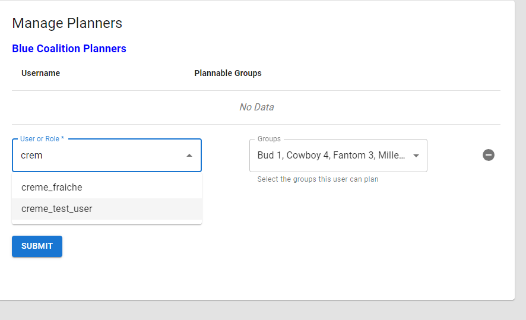
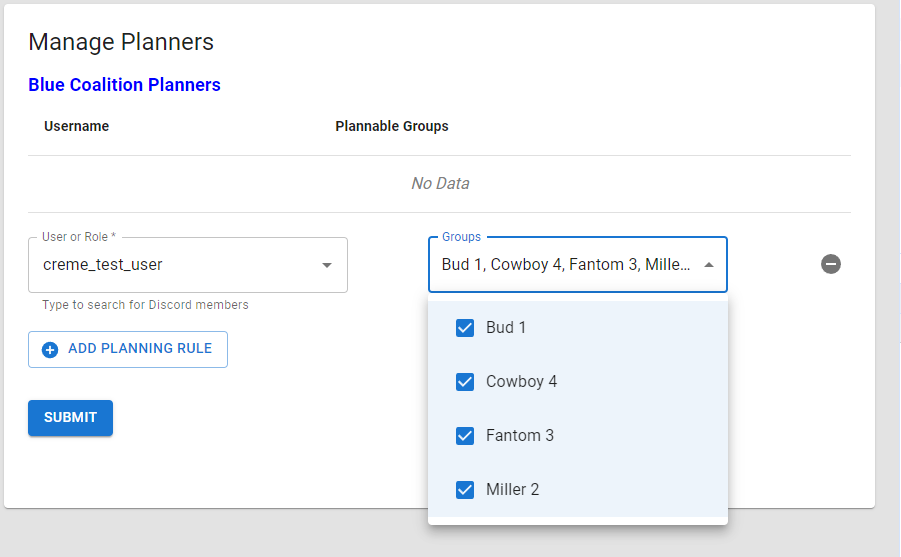

# Managing Planners

Frag Orders allows for mission participants to plan their flights ahead of time. This can include setting waypoints, radio frequencies, and laser codes. 

Once planners have submitted their plan, Frag Orders will apply that input to the .miz file.

## Discord authentication and authorization

Authentication and authorization in Frag Orders is done via Discord. A frag order must be associated with a Discord server to enable auth features.

### Adding the Frag Orders bot to your Discord server

Discord manages access via Bots, and the Frag Orders bot must be added to your Discord server in order to add planners from it. To add the bot to your server, select your desired server and click the "Add Frag Orders Bot" button:

You will be taked to the Discord authorization redirect page, where you can select a server from the dropdown:

Note that you must be an admin of a server to add a bot, or have the required Discord permissions for adding external applications.

### Associating your Frag Order

You can associate your frag order at the creation screen, or via the Manage Planners interface.

Once the bot has been added to the server, you will be able to associate your frag order with that Discord server.

## Adding planning rules

A planning rule will determine which user(s) get to plan the flyable groups in your mission. You can use this to ensure that only certain users are allowed to plan a flight.

Only one user may plan a given group. This avoids conflicting plans being submitted by different users.

To add a planning rule, select the name of the user, or begin typing to peform a search of the Discord server associated with the frag order:

Then select the groups they will be able to plan. By default, a user can plan all groups:

Note that any additional users you want to add will only be able to select from the remaining groups:

Removing a planning rule will disable planning input for that user, but will not delete their plan(s). Once a plan has been submitted, you will see the "Planning Status" table get populated. From here, a mission creator can choose to remove a users plan, which will ensure it does not get applied to the mission.

import Alert from '@mui/material/Alert'
import Box from '@mui/material/Box'
import Typography from '@mui/material/Typography'

<Box my={2}>
<Alert severity="warning">
<Typography fontWeight={600}>Removing a plan is a descructive action!</Typography> Please let your planners know that you will be removing their plan, as any data entry they have done will be deleted permanently.
</Alert>
</Box>

All published coalitions can have planning rules configured, and the individual coalition publishes will not show the opposing coalition's plan.

