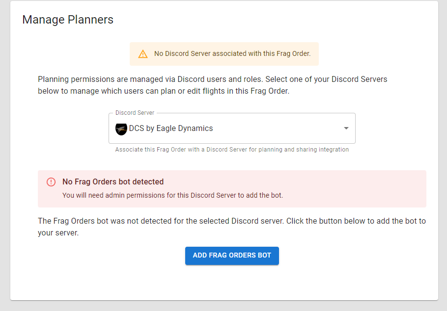
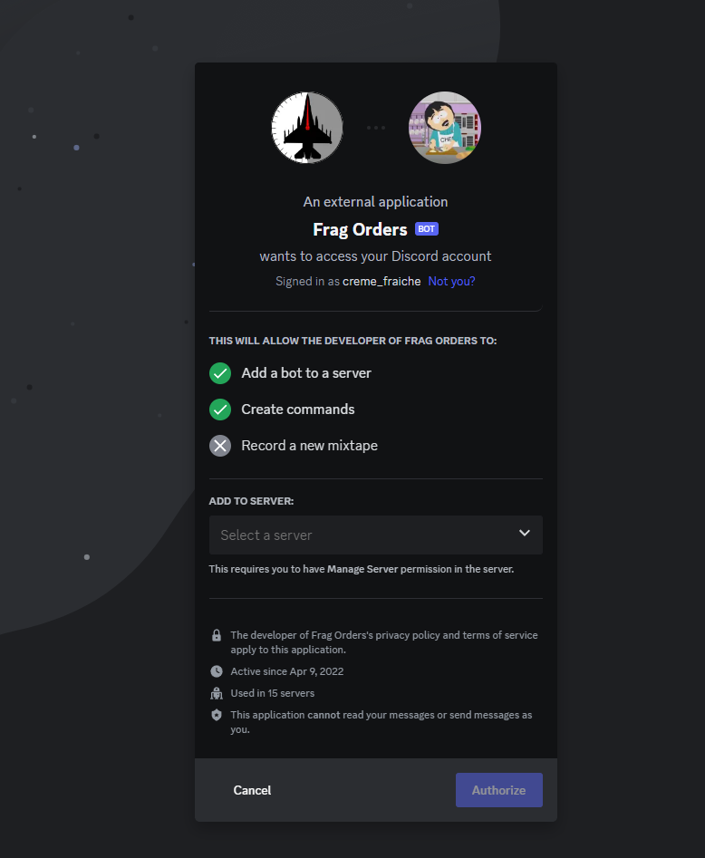
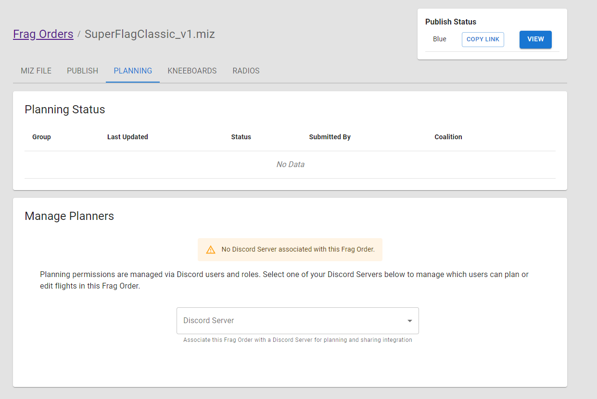
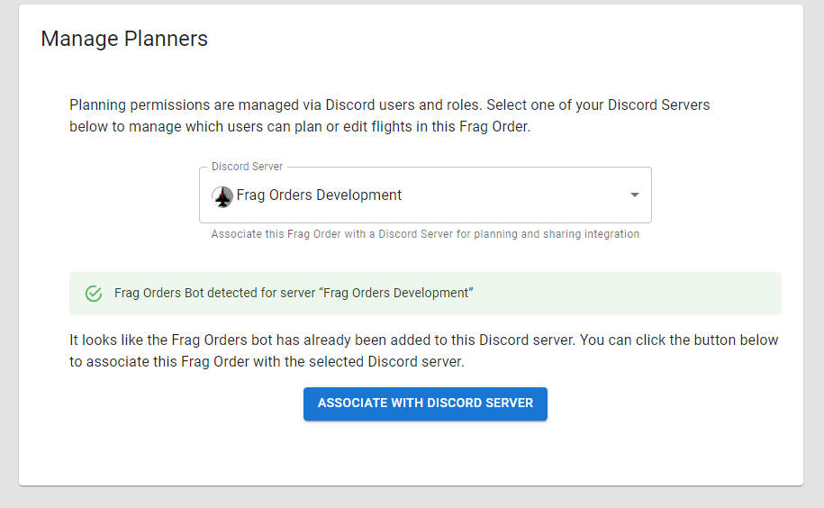
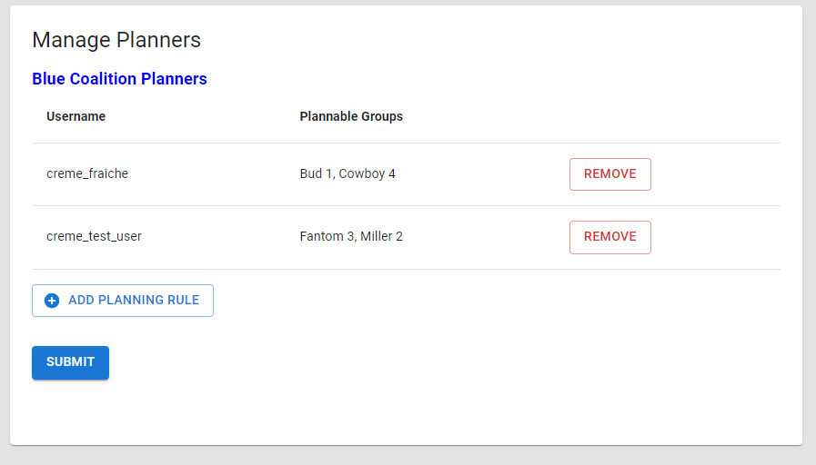
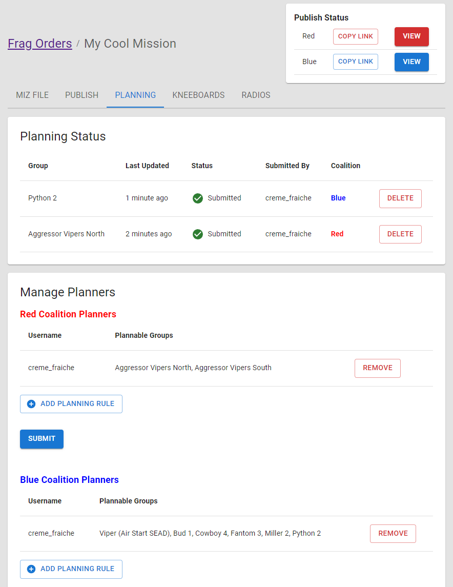

# Managing Planners

Frag Orders allows for mission participants to plan their flights ahead of time. This can include setting waypoints, radio frequencies, and laser codes. 

Once planners have submitted their plan, Frag Orders will apply that input to the .miz file.

## Discord authentication and authorization

Authentication and authorization in Frag Orders is done via Discord. A frag order must be associated with a Discord server to enable auth features.

### Adding the Frag Orders bot to your Discord server

Discord manages access via Bots, and the Frag Orders bot must be added to your Discord server in order to add planners from it. To add the bot to your server, select your desired server and click the "Add Frag Orders Bot" button:

You will be taked to the Discord authorization redirect page, where you can select a server from the dropdown:

Note that you must be an admin of a server to add a bot, or have the required Discord permissions for adding external applications.

### Associating your Frag Order

You can associate your frag order at the creation screen, or via the Manage Planners interface.

Once the bot has been added to the server, you will be able to associate your frag order with that Discord server.

## Adding and editing planning rules

A planning rule will determine which user(s) get to plan the flyable groups in your mission. 
You can use this to ensure that only certain users are allowed to plan a flight.

To create a planning rule, click the "Add Planning Rule" button to bring up the dialog box:

Note that any additional users you want to add will only be able to select from the remaining groups:

Removing a planning rule will disable planning input for that user, but will not delete their plan(s). Once a plan has been submitted, you will see the "Planning Status" table get populated. From here, a mission creator can choose to remove a users plan, which will ensure it does not get applied to the mission.

### Handling multiple planners for a single group

It is possible for multiple users to submit a plan for the same group. This can have some benefits, such as one person setting waypoints and another setting laser codes. 
There can be situations where two plans submitted by different users are in conflict, however.

Frag Orders will try to merge all submitted plans using a "field level" merge strategy. Frag Orders will use the following logic to merge the plans together:

* If one Plan has a field defined and the other plan(s) do not, **the Plan with data will take precedence for that field**. For example, if one Plan has waypoints defined and another does not, the Plan with waypoints takes precedence for that field.
* If two or more Plans have data in the same fields, **the plan that was updated most recently will take precedence**.

In addtion, as mission creator, you have two available tools for handling conflicting plans:

* **Invalidate**: This is a non-descructive way to ignore a Plan. This can be helpful if two users submitted data for the same group, and you do not want to erase the data in one plan. Plans that have an "Invalid" status will be ignored when writing to the .miz file, but will still be present in the Public Frag Order. Users will be able to resubmit their invalid plans.
* **Delete**: This is a descructive action that removes the Plan entirely. Planners will not be able to recover their data.

:::warning
**Removing a plan is a descructive action!**

Please let your planners know that you will be removing their plan, as any data entry they have done will be deleted permanently.
:::

All published coalitions can have planning rules configured, and the individual coalition publishes will not show the opposing coalition's plan.

