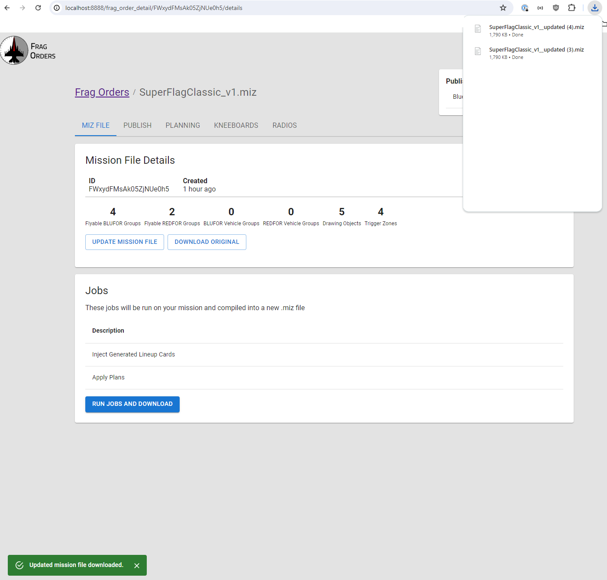
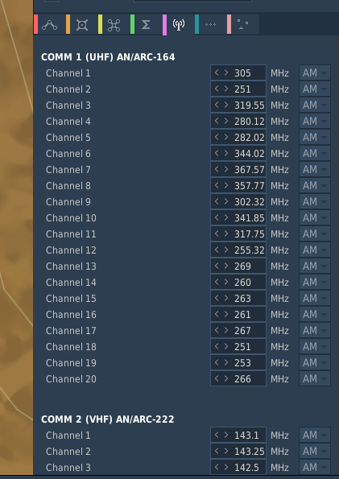

# Exporting a mission file

When you are ready to run your mission, Frag Orders will run a series of jobs on your original .miz file and output an updated .miz file. These jobs are based on the various options you have selected in the frag order settings.

## Running Jobs

Navigate to the "Miz File" tab of the frag order admin interface. The "Jobs" section will list the various jobs you have selected via the other sections of the interface. These jobs will be applied to a copied version of your .miz file and then downloaded. <b>The filename of the download will be the original name of your .miz with and added `__updated` suffix</b>:

## Validate the exported .miz file

You can open your .miz file in DCS like you would any other mission. You should see that jobs have been applied and data reflects what was input in Frag Orders.

import Alert from '@mui/material/Alert'
import Box from '@mui/material/Box'
import Typography from '@mui/material/Typography'

:::warning
**Always version and save your .miz in the DCS Mission Editor!**

To avoid .miz file corruption errors errors, you should always save the Frag Orders output .miz as a new version of your mission. 
        
This will clean any bad data inputs that users may have set, and ensure any version compatibilty issues are caught before uploading to your multiplayer server.
:::